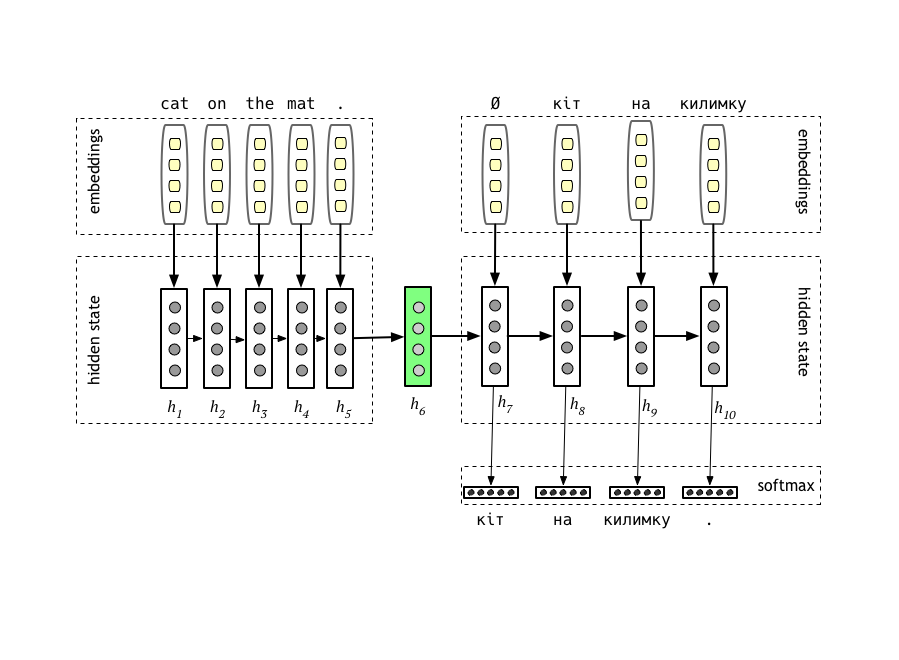
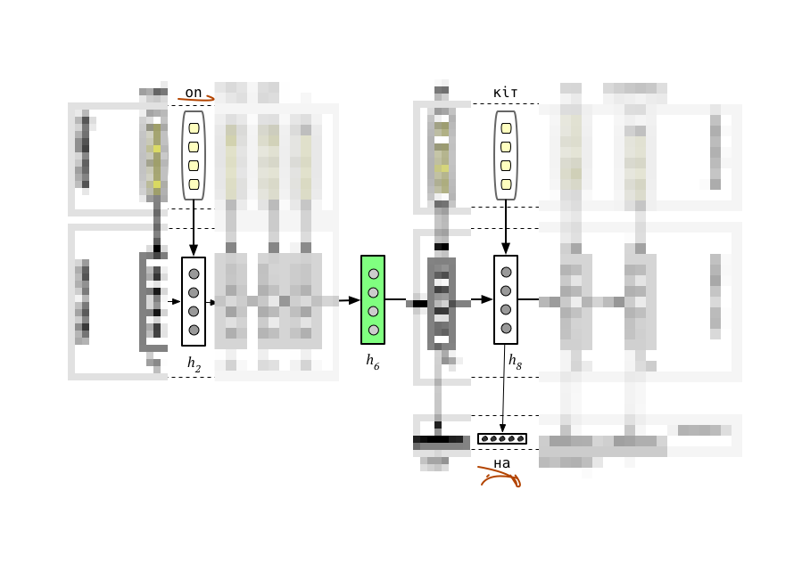

class: center, middle

# Neural Attention Mechanism in NLP

Oleksiy Syvokon

research engineer @ Grammarly

---

# Why bother?

.right[
>>> I am very excited by the recently introduced
>>> *attention models*, due to their simplicity and due to
>>> the fact that they work so well.
>>>
>>> — <cite>Ilya Sutskever</cite>
]

???

Ilya is a Co-Founder and Research Director at OpenAI

--
1. Achieve state-of-the-art results on many NLP applications:

    * Neural translation
    * Text summarization
    * Text entailment
    * Text comprehension (question answering)
--

2. Easy to implement and grasp
--

3. Useful visualisations.

---

# Agenda

1. Prerequisites

    - sentence embeddings
    - sequence-to-sequence 101
    - encoder-decoder bottleneck

--
2. Attention mechanism

    - neural translation task
    - text entailment task
--

3. Attention advances:

    - soft vs hard
    - local vs global
    - hierarchical
    - attention-over-attention
    - gated

---

# Sequence-to-sequence models

---

# Neural Machine Translation

Neural Machine Translation (NMT) aims to model the
entire MT process via **one** big artificial neural
network.

---

# Encoder-decoder

???

Read the source sentence one token a time. Often, token is a word,
but also can be a character or sub-word.

Compute the source sentence embedding from the sequence of hidden states
$h_1 ... h_n$.  In the simpliest case (which works reasonably well), just take
the last state,  $h_5$ in this example. Other options include convolving
over hidden states, or combining them in a recursive-tree manner.

What matters, is that in the end we have a single vector `h_6` that represents
(encodes) the whole sentence. This sentence embedding can be somewhat
similar to the familiar word embeddings. For example, sentences that have
similar meaning will likely have representations that are close to each other.

Having sentence embedding in hand, we can use it for banch of tasks.
We can feed it into a classifier to get sentence category, like sentiment.
For a pair of sentences, we can concatenate the two states and again feed that
to a classifer, for example, to predict entailment relations.

For encoder-decoder architectures, we use that embedding to generate an
output sequence. We have another recurrent network (say, LSTM), that starts
with its state initialized by $h_6$. From that, it generates a new hidden
state, $h_7$, and predicts the first token by generating a softmaxed
distribution over the vocubalary. Let's say, we've picked the $argmax(y_7)$,
everything went well and the first word was "кіт" in our case, just as expected.

On the next step, we feed the predicted $y$ and the previous hidden state
$h_7$ to generate the probabilty distribution for the second word.
We continue until we see the end-of-sentence symbol.

That is a general intuition of how neural translation works. In practice,
of course, it is slighetly more complicated. The architecture has several
layers. Normally, bi-directional LSTM are used, so that we encode source sentence
*twice*, the original and the reversed version, and the concatenate the two
state vectors. On the decoder stage, it is common to do a beam search
(with a relatevily small beam size of 3 to 15) instead of a greedy search
that I've described. However, even the simple architecture will be able
to give more-or-less meaningful results.

---

# Encoder-decoder: state bottleneck

State bottleneck: 

???

The idea of representing the whole sentence meaning in a single fixed-sized
vector is very appealing, but it also means that the decoder must start
having only a fixed-sized vector at hand. Unfortunately, it doesn't work that
well with long sentences. Intuitevely, when we try to cramp the long and/or
complicated sentence into a fixed-sized vector, we will inevitably loose
details that are important for tasks like translation.

It would be nice if we could return ("attend") to the original sentence many 
times as we generating an output sequence. That is where attention mechanism
comes into play.

---

# Attention intuition

???

What we humans do when translating, is regularaly look onto the source sentence
a couple words a time.

When I at the start of the sentence, I will look at the word "cat".

---

# Attention intuition

???

Then I move to the next word, and only interested in it (and maybe also in
some surroinding context as well as in the general context of what this
sentence is all about).

---

# Attention intuition

???

Finally, I get the last part.

---

# Attention intuition: words alignment

TODO: Alignment matrix

???

Turns out, machine translation has known this long before recurrent nets
revivals. They call it "words alignment", and it can be represented by
the alignment matrix:

---

# Content-based neural attention

.left-column30
 

.right-column70[
#### Neural Machine Translation by Jointly Learning to Align and Translate

Dzmitry Bahdanau, Kyunghyun Cho, Yoshua Bengio.

2015

]

???

* ICLR 2015 paper
* Graduated Belarusian State University
* 1215 citations so far (and counting) -- every paper about attention cites this.
* Started the attention boom
* Simple and effective techinique

---

# Content-based neural attention

Concatenate hidden state vectors corresponding to the input into a matrix $H$:

$$ H = \left[ \begin{array}{c} h_1 & h_2 & h_3 & ... & h_n \end{array} \right] $$

???

Okay, let's dig into some details.

As before, we start by encoding the source sentence with RNN (often, with a
bi-directional RNN, but that doesn't really matter). This time we keep around
hidden state vectors corresponding to the input words. Let's concatenate them
in a matrix $H$:

$$ H = \[ h_1 h_2 ... h_n \] $$

---

# Attention intuition

* Simple random access memory
* Can access source states as needed

---

# Other Applications

* Caption generationA [Show, Attend and Tell]

# Gated Attention

## Gated-Attention Readers for Text Comprehension

[Dhingra, 2017]

???

* ICLR 2017 paper.
* State-of-the-art on cloze-style questions.

---

# Attention-over-Attention

Introduced in [Cui, Chen, 2016] for cloze-style
reading comprehension task.

---

# Attention networks results

---

# Stanford Natural Language Inference Corpus

**ENTAILMENT**:
  * A man rides a bike on a snow covered road.
  * A man is outside.

**NEUTRAL**:
  * 2 female babies eating chips.
  * Two female babies are enjoying chips.

**CONTRADICTION**
  * A man in an apron shopping at a market.
  * A man in an apron is preparing dinner.
